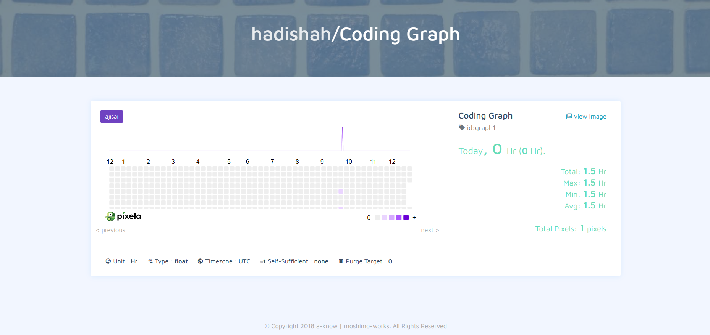

# 📊 Pixela Habit Tracker

A Python script that tracks daily coding hours and visualizes them using the Pixela API, similar to a GitHub contribution heatmap.

## ✨ Technologies

- `Python`
- `Requests`
- `API`
- `HTTP`
- `Datetime`
- `Environment Variables`

## 🚀 Features

- Creates and updates a Pixela graph via HTTP requests
- Logs daily coding hours as data points
- Visualizes progress over time in a heatmap-style graph
- Secure handling of authentication tokens
- Simple command-line input for daily tracking

## 📍 The Process

This project was built as **Day 37 of the 100 Days of Python Code** course to understand how HTTP requests work in practice.

The focus was on learning how to use different HTTP methods with the `requests` library, particularly `POST` requests, and how APIs authenticate requests using custom headers.

The Pixela service was used to visualize daily coding activity. After configuring the graph parameters, the script sends daily pixel data containing the date and quantity of hours coded. This data is then displayed on the user’s Pixela profile as a contribution-style heatmap.

The project also reinforced working with environment variables to securely store API tokens and user credentials.

## 🚦 Running the Project

1. Clone the repository  
2. Set required environment variables:
   - `PIXELA_TOKEN`
   - `PIXELA_USERNAME`
3. Install dependencies: `pip install requests`
4. Run the script: `python main.py`
5. Enter the number of hours coded when prompted
6. View the updated graph on your Pixela profile

## 🎞️ Preview

